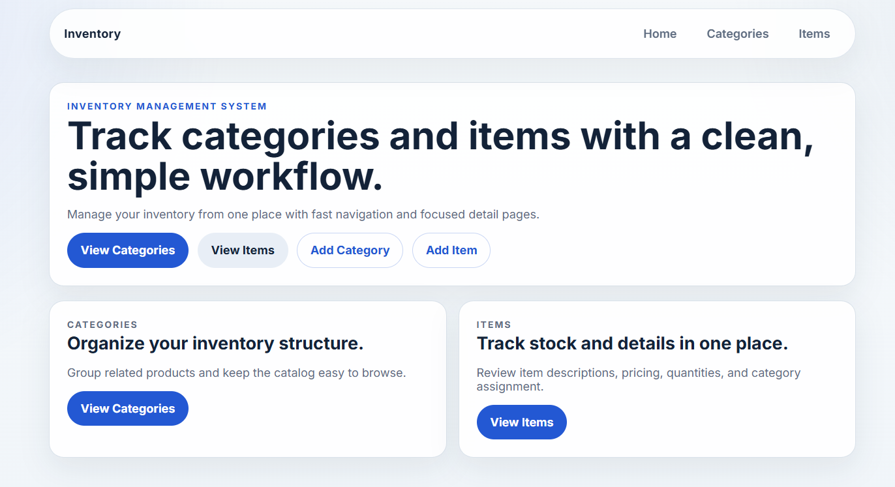
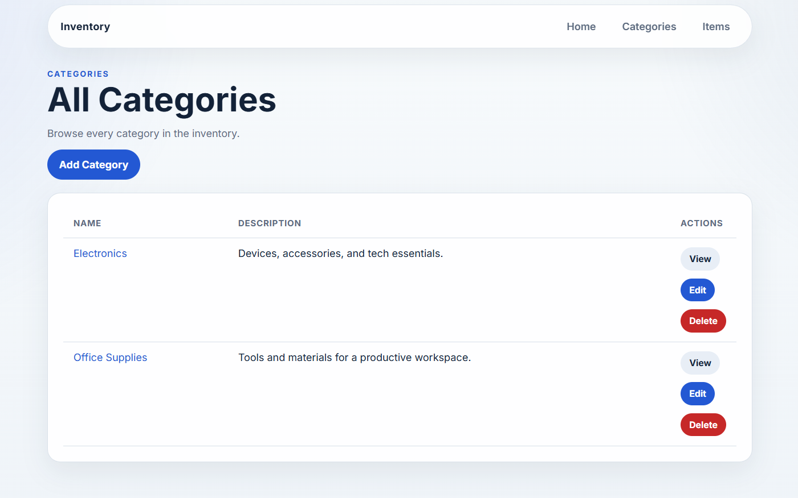
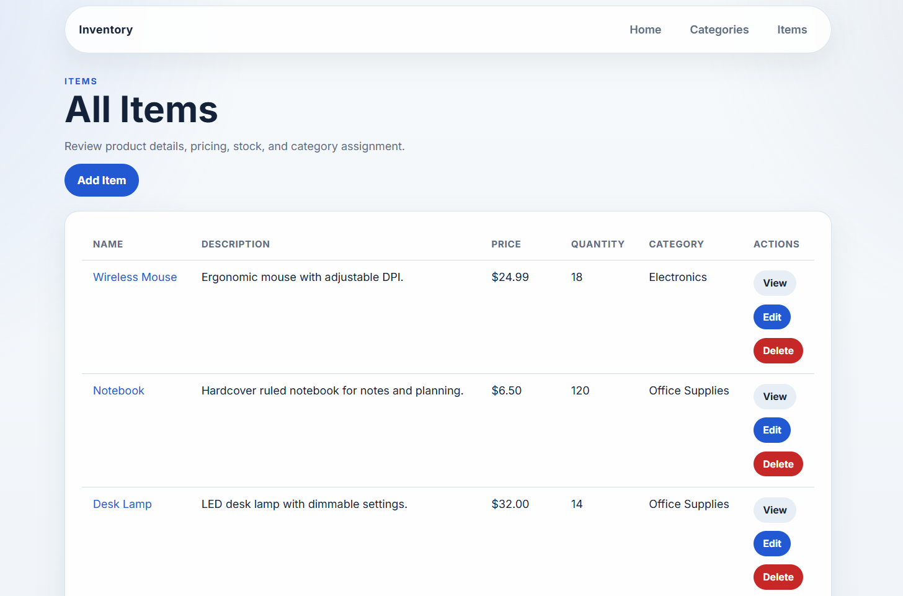
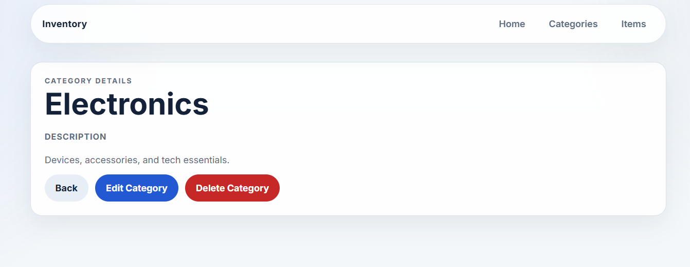
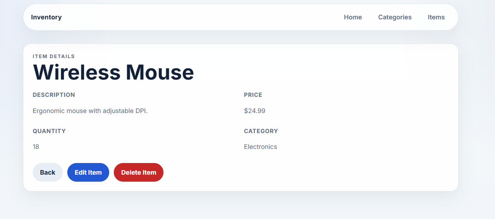
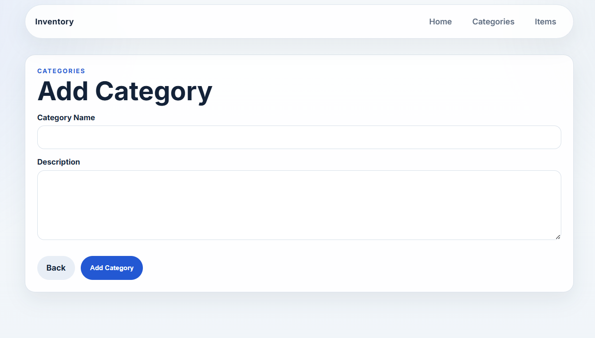
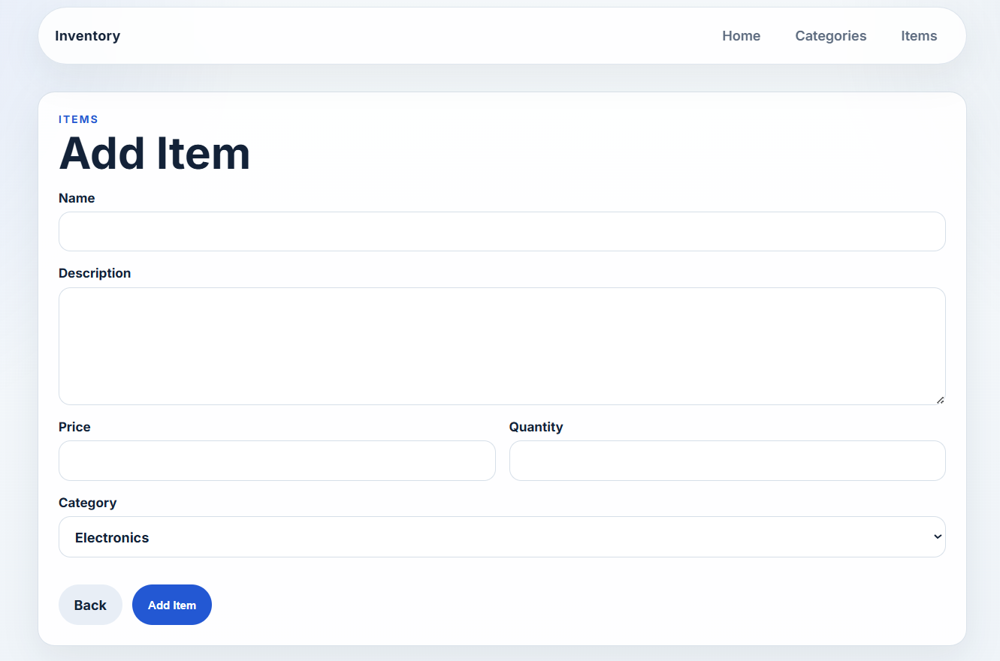
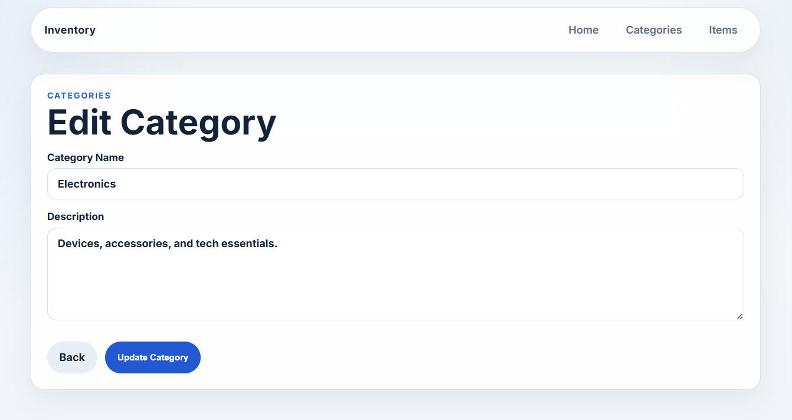
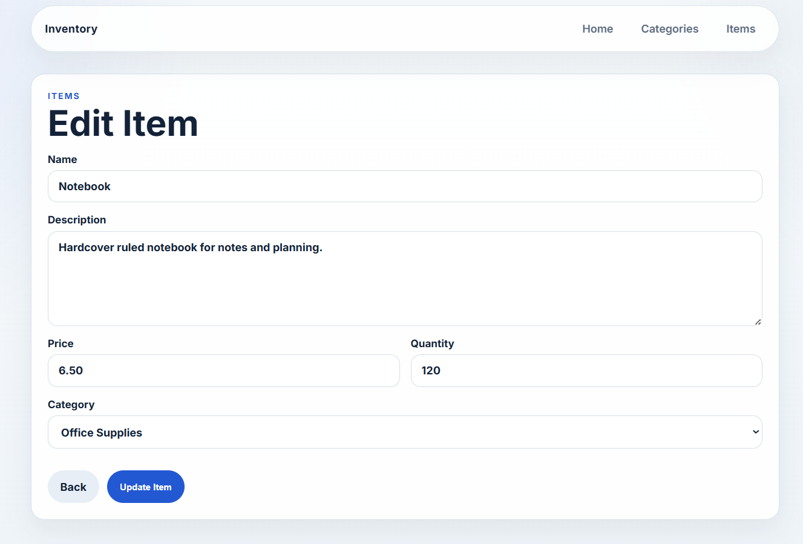

# Inventory Management System 📦


## Overview

This is a full-stack Inventory Management System built for The Odin Project using Node.js, Express.js, PostgreSQL, and EJS in an MVC architecture. The application demonstrates server-side rendering, relational data modeling, form handling, and CRUD workflows for managing inventory categories and items.

The project is designed as a clean, portfolio-ready CRUD application with reusable views, structured database queries, and a responsive HTML/CSS interface.

## Features

- Category management with create, view, edit, and delete flows
- Item management with create, view, edit, and delete flows
- PostgreSQL-backed relational data model
- Foreign key relationship between items and categories
- Category delete protection when linked items still exist
- Dynamic server-rendered pages using EJS
- Reusable form templates for create and edit pages
- Shared layout partials for navigation and metadata
- Responsive UI with custom CSS only
- Clean homepage with quick actions and feature cards
- Database seed script that recreates schema and loads sample data
- MVC organization with routing, controllers, and query separation
- Parameterized SQL queries throughout the data layer

## Screenshots

### Home Page



### Categories



### Items



### Category Details



### Item Details



### Create Forms





### Edit Forms





## Tech Stack

### Backend

- Node.js
- Express.js
- MVC architecture

### Database

- PostgreSQL
- node-postgres (`pg`)
- Relational schema with foreign keys

### Frontend

- EJS templates
- HTML5
- CSS3

### Development Tools

- npm
- Git
- PostgreSQL client/server

## Project Structure

```text
inventory-application/
├─ app.js
├─ package.json
├─ package-lock.json
├─ plan.txt
├─ test-db.js
├─ controllers/
│  ├─ categoryController.js
│  └─ itemController.js
├─ db/
│  ├─ pool.js
│  ├─ populatedb.js
│  └─ queries.js
├─ public/
│  └─ styles.css
├─ routes/
│  ├─ categoryRouter.js
│  ├─ indexRouter.js
│  └─ itemRouter.js
└─ views/
   ├─ index.ejs
   ├─ categories.ejs
   ├─ categoryDetails.ejs
   ├─ categoryForm.ejs
   ├─ deleteCategory.ejs
   ├─ deleteItem.ejs
   ├─ items.ejs
   ├─ itemDetails.ejs
   ├─ itemForm.ejs
   ├─ partials/
   │  ├─ head.ejs
   │  └─ nav.ejs
   └─ forms/
```

## Database Design

The application uses two related tables:

### Categories

- `id`: Primary key
- `name`: Category name
- `description`: Category description

### Items

- `id`: Primary key
- `name`: Item name
- `description`: Item description
- `price`: Item price
- `quantity`: Current stock quantity
- `category_id`: Foreign key referencing `categories.id`

### Relationship

Each item belongs to exactly one category. The `items.category_id` column links each item to its parent category, which allows the application to display category names in item views and prevent category deletion while items still exist.

## CRUD Functionality

| Entity | Create | Read | Update | Delete |
| --- | --- | --- | --- | --- |
| Categories | Yes | Yes | Yes | Yes |
| Items | Yes | Yes | Yes | Yes |

## Installation

1. Clone the repository and enter the project folder.

```bash
git clone <repository-url>
cd inventory-application
```

2. Install dependencies.

```bash
npm install
```

3. Configure PostgreSQL.

- Create a PostgreSQL database named `inventory_db`.
- Update the connection settings in `db/pool.js` so they match your local PostgreSQL credentials if needed.

4. Seed the database.

```bash
node db/populatedb.js
```

5. Start the development server.

```bash
npm start
```

You can also run the app in watch mode during development:

```bash
npm run dev
```

## Usage

Open the application in your browser at `http://localhost:3000`.

- The Home page provides quick navigation to Categories and Items.
- The Categories section lets you create, inspect, edit, and delete categories.
- The Items section lets you create, inspect, edit, and delete items.
- Item forms use a category dropdown populated from the database.
- Category deletion is blocked when that category still has linked items.
- All pages include persistent navigation links for Home, Categories, and Items.

## Learning Outcomes

This project demonstrates practical experience with:

- Express.js routing and middleware
- PostgreSQL database design and querying
- SQL joins for relational data display
- Foreign keys and referential integrity
- MVC architecture and separation of concerns
- CRUD operations across multiple entities
- Server-side rendering with EJS
- REST-style resource routing
- Form handling with `POST` requests
- Reusable layout and partial templates

## Future Improvements

- Add authentication and session-based login
- Introduce user roles and permissions
- Add search and filtering for items and categories
- Add pagination for large inventories
- Support image uploads for items
- Expose a REST API alongside the server-rendered UI
- Containerize the app with Docker
- Add automated unit and integration tests
- Deploy to a cloud platform

## License

This project is intended to be licensed under the MIT License.

## Author

Salman